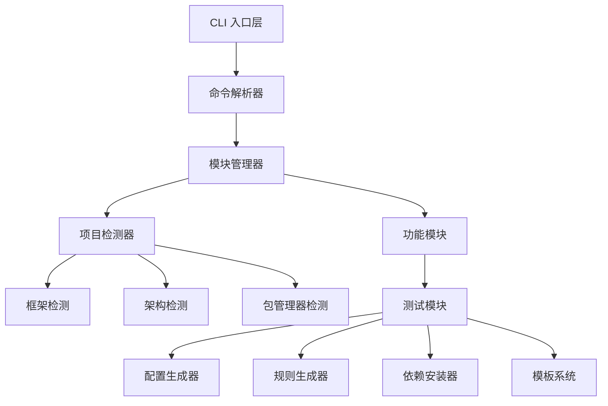

# 设计文档

## 概述

本设计文档描述了 Pilot v1.0 完善版的技术架构和实现方案。Pilot 是一个前端项目增强 CLI 工具，专注于智能测试环境配置。该工具通过自动检测项目技术栈和架构，生成相应的测试配置、AI 增强规则和 Vitest 设置。

当前版本已具备基础功能框架，本次设计旨在完善和增强现有功能，使其达到生产就绪状态。

## 架构设计

### 整体架构



### 核心组件设计

#### 1. CLI 命令系统

**当前状态：** 基础 CLI 框架已实现，支持 `pilot add testing` 命令
**改进目标：** 增强命令系统的扩展性和用户体验

```typescript
// 扩展后的 CLI 架构
interface CLICommand {
  name: string
  description: string
  options: CLIOption[]
  handler: (args: any) => Promise<void>
}

interface CLIOption {
  name: string
  alias?: string
  description: string
  type: 'boolean' | 'string' | 'array'
  default?: any
}
```

**设计要点：**

- 保持现有 `add` 命令结构不变
- 预留扩展接口支持未来的 `remove`、`update`、`list`、`status` 命令
- 增强 `--help` 输出，提供详细的使用文档
- 改进错误处理和用户反馈

#### 2. 项目检测引擎

**当前状态：** 基础检测功能已实现，支持框架、架构、包管理器检测
**改进目标：** 提高检测准确性和容错能力

```typescript
interface EnhancedProjectDetection extends ProjectDetection {
  // 新增字段
  isTypeScript: boolean
  hasExistingTests: boolean
  existingTestFrameworks: string[]
  workspacePackages?: WorkspacePackage[]
  dependencyVersions: Record<string, string>
}

interface WorkspacePackage {
  name: string
  path: string
  packageJson: any
  techStack: TechStack
}
```

**检测策略增强：**

- **版本兼容性检测：** 分析现有依赖版本，选择兼容的测试工具版本
- **冲突检测：** 识别现有测试配置和依赖冲突
- **工作区深度分析：** 对 monorepo 项目进行包级别的详细分析
- **TypeScript 支持检测：** 自动识别 TypeScript 项目并生成相应配置

#### 3. 模板系统重构

**当前状态：** 基础模板文件存在，但功能有限
**改进目标：** 构建完整的模板生态系统

```typescript
interface TemplateSystem {
  getTemplate(type: TemplateType, context: TemplateContext): Promise<string>
  renderTemplate(template: string, variables: Record<string, any>): string
  validateTemplate(template: string): boolean
}

interface TemplateContext {
  techStack: TechStack
  architecture: ProjectArchitecture
  isTypeScript: boolean
  hasWorkspace: boolean
  packageManager: string
}

enum TemplateType {
  VITEST_CONFIG = 'vitest-config',
  TEST_SETUP = 'test-setup',
  TESTING_STRATEGY = 'testing-strategy',
  PACKAGE_JSON_SCRIPTS = 'package-scripts',
}
```

**模板文件组织：**

```
src/modules/testing/templates/
├── vitest-config/
│   ├── react.template
│   ├── vue2.template
│   ├── vue3.template
│   └── workspace.template
├── test-setup/
│   ├── react.template
│   ├── vue2.template
│   └── vue3.template
├── testing-strategy/
│   └── base.template
└── shared/
    ├── base.template
    └── typescript.template
```

#### 4. 依赖管理系统

**当前状态：** 基础依赖安装功能
**改进目标：** 智能依赖管理和版本兼容性

```typescript
interface DependencyManager {
  analyzeDependencies(projectInfo: EnhancedProjectDetection): Promise<DependencyAnalysis>
  installDependencies(deps: DependencySpec[], options: InstallOptions): Promise<void>
  detectConflicts(newDeps: DependencySpec[], existing: Record<string, string>): ConflictReport
  resolveVersions(deps: DependencySpec[], constraints: VersionConstraints): ResolvedDependencies
  analyzeCompatibleVersions(existingDeps: Record<string, string>): Promise<CompatibilityMatrix>
}

interface DependencySpec {
  name: string
  version?: string
  dev: boolean
  peer?: boolean
  optional?: boolean
}

interface VersionConstraints {
  react?: string
  vue?: string
  typescript?: string
  node?: string
}

interface CompatibilityMatrix {
  [framework: string]: {
    [version: string]: {
      testingLibrary: string
      vitest: string
      jsdom: string
      additionalDeps: DependencySpec[]
    }
  }
}
```

**依赖策略：**

- **版本兼容性矩阵：** 维护框架版本与测试工具版本的兼容性映射
- **智能版本选择：** 根据项目现有依赖自动选择最佳版本
- **冲突解决：** 提供多种冲突解决策略供用户选择
- **增量安装：** 只安装缺失的依赖，避免重复安装

## 组件和接口设计

### 1. 配置生成器增强

```typescript
interface ConfigGenerator {
  generateVitestConfig(context: ConfigContext): Promise<ConfigResult>
  generateTestSetup(context: ConfigContext): Promise<ConfigResult>
  mergeExistingConfig(existing: any, generated: any): Promise<any>
  validateConfig(config: any): ValidationResult
}

interface ConfigContext {
  projectInfo: EnhancedProjectDetection
  options: ModuleOptions
  existingConfig?: any
  templateVariables: Record<string, any>
}

interface ConfigResult {
  content: string
  filePath: string
  backup?: string
  conflicts?: ConflictInfo[]
}
```

### 2. AI 规则生成器增强

```typescript
interface RulesGenerator {
  generateTestingStrategy(context: RulesContext): Promise<string>
  analyzeProjectStructure(rootDir: string): Promise<ProjectStructure>
  generateFrameworkSpecificRules(techStack: TechStack): Promise<string>
  mergeWithExistingRules(existing: string, generated: string): Promise<string>
}

interface RulesContext {
  projectInfo: EnhancedProjectDetection
  projectStructure: ProjectStructure
  projectType: 'component-library' | 'business-app' | 'utility-library'
}

interface ProjectStructure {
  hasComponents: boolean
  hasPages: boolean
  hasUtils: boolean
  hasHooks: boolean
  testPatterns: string[]
  complexity: 'simple' | 'medium' | 'complex'
}
```

### 3. 错误处理和恢复系统

```typescript
interface ErrorHandler {
  handleError(error: PilotError): Promise<void>
  rollback(operation: Operation): Promise<void>
  suggestSolution(error: PilotError): string[]
  logError(error: PilotError, context: any): void
}

interface PilotError extends Error {
  code: ErrorCode
  category: ErrorCategory
  recoverable: boolean
  context?: any
}

enum ErrorCode {
  PROJECT_DETECTION_FAILED = 'PROJECT_DETECTION_FAILED',
  DEPENDENCY_INSTALL_FAILED = 'DEPENDENCY_INSTALL_FAILED',
  CONFIG_GENERATION_FAILED = 'CONFIG_GENERATION_FAILED',
  FILE_SYSTEM_ERROR = 'FILE_SYSTEM_ERROR',
  NETWORK_ERROR = 'NETWORK_ERROR',
}
```

## 数据模型

### 项目信息模型

```typescript
interface ProjectInfo {
  // 基础信息
  rootDir: string
  packageJson: any

  // 技术栈信息
  techStack: TechStack
  architecture: ProjectArchitecture
  packageManager: PackageManager

  // 环境信息
  isTypeScript: boolean
  nodeVersion: string

  // 现有配置
  existingConfigs: ExistingConfig[]
  existingDependencies: Record<string, string>

  // 工作区信息（如果适用）
  workspaceInfo?: WorkspaceInfo
}

interface ExistingConfig {
  type: 'vitest' | 'jest' | 'testing-library' | 'custom'
  filePath: string
  content: any
  conflicts: string[]
}

interface WorkspaceInfo {
  type: 'pnpm' | 'yarn'
  packages: WorkspacePackage[]
  rootPackageJson: any
  currentLocation: 'root' | 'package'
  currentPackage?: WorkspacePackage
}
```

### 配置模板模型

```typescript
interface Template {
  id: string
  name: string
  description: string
  techStack: TechStack[]
  architecture: ProjectArchitecture[]
  content: string
  variables: TemplateVariable[]
  dependencies: DependencySpec[]
}

interface TemplateVariable {
  name: string
  type: 'string' | 'boolean' | 'array' | 'object'
  required: boolean
  default?: any
  description: string
}
```

## 错误处理策略

### 错误分类和处理

1. **检测错误**
   - 项目类型无法识别 → 提供手动覆盖选项
   - package.json 缺失 → 引导用户到正确目录
   - 依赖版本冲突 → 提供解决方案建议

2. **配置错误**
   - 现有配置冲突 → 智能合并或用户选择
   - 模板渲染失败 → 回退到基础模板
   - 文件写入失败 → 权限检查和路径验证

3. **安装错误**
   - 网络连接问题 → 重试机制和离线模式
   - 依赖版本不兼容 → 版本降级或替代方案
   - 包管理器错误 → 切换包管理器或手动安装指导

### 恢复机制

```typescript
interface RecoveryStrategy {
  backup(): Promise<BackupInfo>
  rollback(backupInfo: BackupInfo): Promise<void>
  retry(operation: Operation, maxAttempts: number): Promise<any>
  fallback(primaryStrategy: Strategy, fallbackStrategy: Strategy): Promise<any>
}
```

## 测试策略

### 单元测试

- **检测器测试：** 验证各种项目类型的正确识别
- **模板系统测试：** 确保模板渲染的正确性
- **配置生成测试：** 验证生成的配置文件语法和逻辑正确性
- **依赖管理测试：** 测试版本解析和冲突检测

### 集成测试

- **端到端流程测试：** 完整的 `pilot add testing` 流程
- **多项目类型测试：** React、Vue2、Vue3 项目的完整配置
- **工作区测试：** pnpm 和 yarn workspace 的正确处理
- **错误场景测试：** 各种错误情况的处理验证

### 兼容性测试

- **Node.js 版本兼容性：** 支持 Node.js 16+
- **包管理器兼容性：** npm、yarn、pnpm 的正确支持
- **操作系统兼容性：** Windows、macOS、Linux 的跨平台支持

## 性能优化

### 检测性能

- **并行检测：** 框架、架构、包管理器检测并行执行
- **缓存机制：** 缓存检测结果避免重复分析
- **懒加载：** 按需加载检测模块和模板

### 安装性能

- **批量安装：** 合并依赖安装请求
- **增量安装：** 只安装缺失的依赖
- **并行下载：** 利用包管理器的并行下载能力

### 内存优化

- **流式处理：** 大文件的流式读写
- **及时释放：** 不再需要的对象及时释放
- **模板缓存：** 合理的模板缓存策略

## 扩展性设计

### 插件系统预留

```typescript
interface PluginSystem {
  registerPlugin(plugin: Plugin): void
  loadPlugins(pluginDir: string): Promise<void>
  executeHook(hookName: string, context: any): Promise<any>
}

interface Plugin {
  name: string
  version: string
  hooks: Record<string, HookFunction>
  dependencies?: string[]
}
```

### 模块系统扩展

- **模块注册机制：** 支持动态注册新的功能模块
- **配置扩展点：** 允许模块扩展配置生成逻辑
- **模板扩展：** 支持自定义模板和模板覆盖
- **检测器扩展：** 允许添加新的项目类型检测器

### 命令系统扩展

- **命令注册：** 支持插件注册新命令
- **选项扩展：** 允许模块添加自定义命令选项
- **中间件系统：** 支持命令执行前后的中间件处理

这个设计确保了 Pilot v1.0 不仅能够完成当前的测试模块功能，还为未来的功能扩展奠定了坚实的架构基础。
